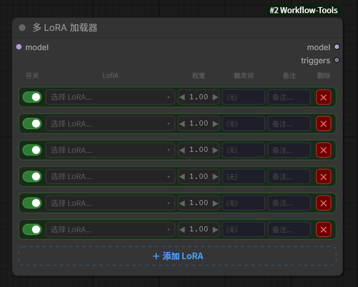
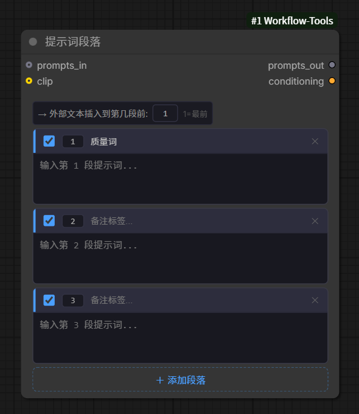
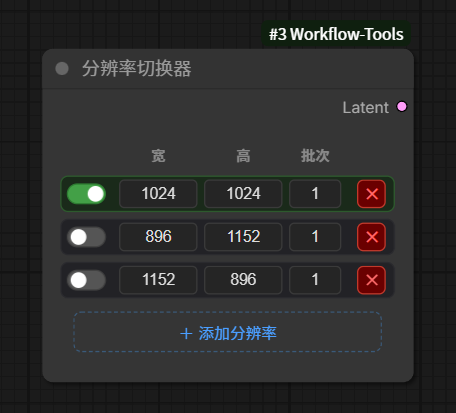

[English](README.md) | [中文](README_ZH.md)

# ComfyUI-Workflow-Tools

A collection of custom nodes for ComfyUI, focused on workflow ergonomics: managing multiple LoRAs in one node, composing prompts from reusable segments, switching resolutions instantly, routing img2img / txt2img latents, and extracting prompts from generated images.

### Language

The frontend UI ships with **Chinese** as the default (`const LANG = "zh"` at the top of each `.js` file in `js/`). To switch the built-in widget labels back to English, change `"zh"` to `"en"` in the relevant `.js` file(s). Node display names are registered in Chinese in [`__init__.py`](__init__.py) (`NODE_DISPLAY_NAME_MAPPINGS`).

### Nodes Overview

| Node | Display Name | Category | Purpose |
|------|--------------|----------|---------|
| MultiLoraLoader | 多 LoRA 加载器 | loaders | Stack and toggle multiple LoRAs in one node |
| PromptSegments | 提示词段落 | conditioning | Combine prompt segments with tag auto-complete |
| ResolutionSwitcher | 分辨率切换器 | latent | Switch between pre-configured resolution presets |
| Img2ImgTxt2ImgSwitch | 图生图 / 文生图 切换 | latent | Route img2img / txt2img latents via a labelled toggle |
| PromptExtractor | 提示词提取器 | image | Extract positive/negative prompts from PNG metadata |

---

## Multi LoRA Loader

Manage multiple LoRAs in a single node. Each LoRA row has its own enable toggle, strength control, trigger word, and note. Trigger words from all enabled LoRAs are concatenated into a single STRING output that can be wired straight into a prompt node.

### Features

- **Per-LoRA toggle** — capsule switch enables/disables each LoRA without removing it
- **Strength control** — three interaction modes in one cell:
  - Click `◀` / `▶` arrows for ±0.01 fine adjustment
  - Click the numeric value to type an exact number (range: -100 to 100)
  - Drag the numeric area horizontally for fast adjustment
- **Searchable LoRA dropdown** — a DOM-based dropdown with:
  - A search box that matches against full path, filename, and underscore-to-space variants
  - A grouped folder tree (auto-expands the folder of the currently selected LoRA)
  - Keyboard navigation (`↑`/`↓` to move, `Enter` to confirm, `Esc` to close)
  - Match highlighting and a match-count hint
- **Trigger words with local memory** — each LoRA's trigger word is stored in `localStorage` under `lora_trigger_<name>`, so it auto-fills when you pick the same LoRA again
- **Triggers output** — concatenates all enabled LoRA trigger words into `", word1, word2, "` format on the `triggers` STRING output
- **Notes** — free-text note per LoRA for context
- **Dynamic add/remove** — add rows with the dashed `＋ Add LoRA` button, remove with the red `✕` button
- Minimum node width: 500px

### Inputs / Outputs

- **Input**: `model` (MODEL), `lora_stack` (STRING JSON, hidden widget)
- **Outputs**: `model` (MODEL), `triggers` (STRING)

### Usage

Add the **Multi LoRA Loader** node, connect your model to the `model` input. Click a LoRA row's dropdown to pick a LoRA, adjust strength, and optionally set a trigger word. Connect the `triggers` output to a text input node (e.g. Prompt Segments' `prompts_in`) to auto-inject trigger words.

---

## Prompt Segments

Combine multiple prompt segments into one node with Danbooru tag auto-complete, ordered output, configurable insert position for incoming text, and optional direct CLIP conditioning.

### Features

- **Dynamic segments** — add/remove prompt segments on the fly with the `＋ Add Segment` button
- **Per-segment toggle** — enable/disable each segment individually; disabled segments collapse to a single line
- **Labels** — each segment has a free-text label for quick organization (defaults to "Quality Tags" for the first segment)
- **Reorder by number** — edit the number in the leftmost cell of a segment to move it to that position
- **Tag auto-complete** — type 2+ characters to surface up to 10 matches from a 10,000+ Danbooru tag dictionary (`js/tags/tag_dictionary.json`):
  - Click a tag chip to insert it (underscores converted to spaces)
  - Keyboard navigation: `↑`/`↓` move across rows, `←`/`→` move within a row, `Tab` inserts the highlighted tag
- **Insert position control** — an `insert_pos` number sets where the incoming `prompts_in` text is inserted (1 = before segment 1, 2 = before segment 2, etc.; values beyond the last segment append to the end)
- **Direct CLIP output** — optionally connect a CLIP model to produce a `conditioning` output that wires straight into a KSampler, bypassing a separate CLIP Text Encode node
- **Auto-resizing textareas** — each segment's textarea grows to fit its content
- Outputs all enabled segments' text joined by `", "`

### Inputs / Outputs

- **Required**: `segments` (STRING JSON, hidden widget), `insert_pos` (INT, default 1, hidden widget)
- **Optional**: `prompts_in` (STRING, forced input), `clip` (CLIP)
- **Outputs**: `prompts_out` (STRING), `conditioning` (CONDITIONING)

### Usage

Add the **Prompt Segments** node. Type your prompt segments into the textareas. Optionally connect `prompts_in` to inject external text (e.g. LoRA triggers) at the position specified by `insert_pos`. Connect `prompts_out` to a CLIP Text Encoder, or connect a CLIP model and use the `conditioning` output directly on a KSampler.

---

## Resolution Switcher

Quickly switch between pre-configured resolution presets without re-typing dimensions every time. Outputs a blank latent with the selected size, mirroring ComfyUI's native EmptyLatentImage.

### Features

- **Radio-style presets** — only one preset is active at a time; clicking another moves the active flag to it (clicking the active one is a no-op, so there is always exactly one active resolution)
- **Per-preset fields** — Width, Height, and Batch Size
- **8-multiple snapping** — W and H are automatically rounded to multiples of 8 (minimum 16), matching ComfyUI's latent space requirements
- **Default presets** — ships with 1024×1024, 896×1152, and 1152×896 (batch 1 each); the first is active by default
- **Dynamic add/remove** — add presets with the `＋ Add Resolution` button, remove with the red `✕` button
- **Defensive fallback** — if no preset is active or the JSON is invalid, falls back to 1024×1024 batch 1 so the node never errors
- Outputs a latent tensor of shape `[batch, 4, height//8, width//8]`

### Inputs / Outputs

- **Required**: `presets` (STRING JSON, hidden widget)
- **Outputs**: `LATENT`

### Usage

Add the **Resolution Switcher** node. Adjust the preset dimensions to your commonly used sizes, then click the toggle on the row you want. Connect the **LATENT** output to your KSampler or any node that accepts latent input.

---

## img2img / txt2img Switch

A semantically labelled LATENT switch for img2img / txt2img pipelines. Functionally equivalent to a generic Switch node, but the inputs and toggle are labelled with the actual pipeline names so you never confuse which side is which.

### Features

- **Visual toggle switch** — a two-sided pill drawn on the canvas:
  - Right side = **txt2img** (green `#2e7d32` background, bright green label when active)
  - Left side = **img2img** (red `#6a1b1b` background, bright red label when active)
- **Two optional LATENT inputs** — `img2img_latent` and `txt2img_latent`
- **Single `latent` output** — forwards whichever side is selected by the toggle
- **State persistence** — the mode is stored in a hidden `mode` BOOLEAN widget and restored on workflow reload
- **Fallback behavior** — if only one side is connected, that side is used regardless of the toggle; if neither is connected, returns `None`

### Inputs / Outputs

- **Required**: `mode` (BOOLEAN, default `true` — hidden, controlled by the visual toggle)
- **Optional**: `img2img_latent` (LATENT), `txt2img_latent` (LATENT)
- **Outputs**: `latent` (LATENT)

### Usage

Add the **img2img / txt2img Switch** node. Connect your img2img latent to `img2img_latent` and your txt2img latent to `txt2img_latent`. Click the toggle to choose which one is forwarded to the `latent` output. Connect the output to your KSampler or any latent-accepting node.

---

## Prompt Extractor

Extract positive and negative prompts from PNG metadata produced by ComfyUI or WebUI (A1111). Natively understands ComfyUI workflows that use Prompt Segments.

### Features

- **Dual metadata sources**:
  - ComfyUI API prompt JSON (from the `prompt` PNG info key)
  - A1111 `parameters` text (parses `Negative prompt:` and trailing generation settings like `Steps:`, `Sampler:`, `Seed:`)
- **Widget-index reference resolution** — resolves ComfyUI `["node_id", widget_idx]` references recursively (depth limit: 10) to follow upstream text nodes
- **Native Prompt Segments support** — when it encounters a PromptSegments node, it parses the segments JSON and joins only the enabled segments' text
- **Upstream text chaining** — for PromptSegments nodes, also resolves and prepends the upstream `prompts_in` text
- **Negative prompt detection** — classifies a CLIPTextEncode / PromptSegments node as negative if its title contains any of: `negative`, `neg`, `负`, `反面`, `反向`, `负面`, `消极`
- **Convention fallback** — when no keyword identifies a negative prompt and there are 2+ positive prompts, the last one is treated as negative (first = positive, second = negative)
- **Deduplication** — removes duplicate prompts within positive and negative lists, and removes any positive prompt that also appears in the negative list
- **Image lookup** — matches the input image tensor against files in ComfyUI's `input/` directory by hashing the first 4KB of pixel data (supports `.png`, `.jpg`, `.jpeg`, `.webp`, `.bmp`)
- **Outputs**: `positive` and `negative` as STRING (returns `"No prompt metadata found."` for positive if no metadata is present)

### Inputs / Outputs

- **Required**: `image` (IMAGE)
- **Outputs**: `positive` (STRING), `negative` (STRING)

### Usage

1. Copy the source PNG into ComfyUI's `input/` folder.
2. Add a standard **Load Image** node and select the file.
3. Connect the **Load Image** output → **Prompt Extractor**.
4. Use the `positive` / `negative` STRING outputs as needed (e.g. feed them into Prompt Segments or a CLIP Text Encoder).
